# 📱 کی‌داره | سوپراپلیکیشن خرید محلی

<div align="center">


[](https://github.com/kidareh-team/kidareh)
[](LICENSE)
[](https://nodejs.org)
[](https://react.dev)
[](https://www.typescriptlang.org)
[](CONTRIBUTING.md)

**سوپراپلیکیشن محلی سریع و هوشمند برای پیدا کردن لحظه‌ای کالاها در فروشگاه‌های اطراف شما**

[نمایش زنده](https://kidareh.com) · [گزارش مشکل](https://github.com/kidareh-team/kidareh/issues) · [درخواست ویژگی](https://github.com/kidareh-team/kidareh/issues/new)

</div>

---

## 📋 فهرست مطالب

- [درباره پروژه](#-درباره-پروژه)
- [ویژگی‌های کلیدی](#-ویژگی‌های-کلیدی)
- [اسکرین‌شات‌ها](#-اسکرین‌شات‌ها)
- [تکنولوژی‌ها](#️-تکنولوژی‌ها)
- [معماری](#-معماری)
- [پیش‌نیازها](#-پیش‌نیازها)
- [نصب و راه‌اندازی](#-نصب-و-راه‌اندازی)
- [ساختار پروژه](#-ساختار-پروژه)
- [متغیرهای محیطی](#-متغیرهای-محیطی)
- [Scripts](#-scripts)
- [API Documentation](#-api-documentation)
- [Deploy](#-deploy)
- [امنیت](#-امنیت)
- [تست](#-تست)
- [مشارکت](#-مشارکت)
- [مجوز](#-مجوز)
- [تیم](#-تیم)
- [پشتیبانی](#-پشتیبانی)

---

## 🎯 درباره پروژه

**کی‌داره** یک پلتفرم نوآورانه برای ارتباط مستقیم خریداران و فروشندگان محلی است که با استفاده از فناوری‌های مدرن و هوش مصنوعی، تجربه خرید را متحول می‌کند.

### 🎪 چرا کی‌داره؟

| مشکل | راه‌حل کی‌داره |
|------|--------------|
| ❌ نمی‌دونم فروشگاه اطرافم چه کالاهایی داره | ✅ جستجوی لحظه‌ای با نقشه تعاملی |
| ❌ باید زنگ بزنم و بپرسم موجوده یا نه | ✅ چت آنلاین مستقیم با فروشنده |
| ❌ قیمت‌ها مشخص نیست | ✅ قیمت‌گذاری شفاف و به‌روز |
| ❌ نمی‌دونم فروشگاه معتبره یا نه | ✅ سیستم امتیازدهی و نظرات کاربران |
| ❌ باید حضوری برم ببینم کالا رو | ✅ عکس‌ها، توضیحات کامل و نقشه مسیر |

### 🏆 ویژگی‌های منحصربه‌فرد

- 🧠 **هوش مصنوعی Google Gemini** - جستجوی صوتی و دستیار هوشمند
- 📍 **موقعیت‌یابی دقیق** - پیدا کردن نزدیک‌ترین فروشگاه‌ها
- 💬 **چت Real-time** - ارتباط فوری با Socket.IO
- 📱 **PWA** - نصب روی موبایل بدون نیاز به استور
- 🎨 **UI/UX مدرن** - طراحی زیبا با Tailwind CSS و Framer Motion
- ⚡ **سرعت بالا** - بهینه‌سازی شده با Vite و React 19
- 🔒 **امنیت پیشرفته** - Helmet, JWT, Rate Limiting
- 💰 **درآمدزایی** - سیستم معرفی و کسب پورسانت

---

## ⭐ ویژگی‌های کلیدی

### 🔍 برای خریداران

<table>
<tr>
<td width="50%">

#### 🗺️ جستجوی نقشه‌محور
- نمایش فروشگاه‌های اطراف روی نقشه
- فیلتر بر اساس فاصله و دسته‌بندی
- مسیریابی به فروشگاه با یک کلیک

</td>
<td width="50%">

#### 🎤 دستیار صوتی
- جستجوی کالا با صدا
- تبدیل گفتار به متن با Gemini
- پیشنهادات هوشمند بر اساس نیاز

</td>
</tr>
<tr>
<td>

#### 💬 چت آنلاین
- گفتگوی لحظه‌ای با فروشنده
- ارسال عکس و فایل
- نوتیفیکیشن آنی برای پیام‌ها

</td>
<td>

#### 🔖 ذخیره و علاقه‌مندی‌ها
- لیست کالاهای مورد علاقه
- مقایسه قیمت فروشگاه‌های مختلف
- اعلان تغییر قیمت

</td>
</tr>
</table>

### 🏪 برای فروشندگان

<table>
<tr>
<td width="50%">

#### 📊 پنل مدیریت حرفه‌ای
- ثبت و ویرایش کالاها
- مدیریت موجودی
- آمار فروش و بازدید

</td>
<td width="50%">

#### 🎯 بازاریابی هوشمند
- نمایش در نتایج جستجوی محلی
- برچسب "ویژه" برای کالاها
- افزایش دیده شدن

</td>
</tr>
<tr>
<td>

#### 💳 پرداخت آسان
- درگاه پرداخت آنلاین
- فاکتور الکترونیکی
- پیگیری تراکنش‌ها

</td>
<td>

#### 📱 مدیریت از موبایل
- دسترسی از هر جا
- آپلود سریع عکس
- پاسخ سریع به مشتریان

</td>
</tr>
</table>

### 🛡️ برای ادمین

- 📈 **داشبورد تحلیلی** - آمار کامل سیستم
- 👥 **مدیریت کاربران** - بررسی و تایید فروشگاه‌ها
- 🚨 **سیستم گزارش‌دهی** - رسیدگی به تخلفات
- 💰 **مدیریت مالی** - تسویه حساب و پورسانت‌ها
- 🔧 **تنظیمات سیستم** - پیکربندی کامل پلتفرم

---

## 📸 اسکرین‌شات‌ها

<div align="center">

### 📱 موبایل


### 🗺️ نقشه تعاملی


### 💬 چت Real-time


</div>

---

## 🛠️ تکنولوژی‌ها

### 🎨 Frontend

| تکنولوژی | نسخه | کاربرد |
|----------|------|--------|
| [React](https://react.dev) | 19.0.0 | کتابخانه UI |
| [TypeScript](https://www.typescriptlang.org) | 5.8.2 | Type Safety |
| [Vite](https://vitejs.dev) | 6.2.0 | Build Tool |
| [Tailwind CSS](https://tailwindcss.com) | 4.1.14 | استایل‌دهی |
| [Framer Motion](https://www.framer.com/motion/) | 12.23.24 | انیمیشن |
| [React Query](https://tanstack.com/query) | 5.62.3 | State Management |
| [React Router](https://reactrouter.com) | 7.1.3 | Routing |
| [Leaflet](https://leafletjs.com) | 1.9.4 | نقشه |
| [Socket.IO Client](https://socket.io) | 4.8.3 | WebSocket |
| [Lucide React](https://lucide.dev) | 0.468.0 | آیکون‌ها |
| [Zod](https://zod.dev) | 3.24.1 | Validation |
| [React Hook Form](https://react-hook-form.com) | 7.54.2 | فرم‌ها |

### ⚙️ Backend

| تکنولوژی | نسخه | کاربرد |
|----------|------|--------|
| [Node.js](https://nodejs.org) | 20+ | Runtime |
| [Express](https://expressjs.com) | 4.21.2 | Web Framework |
| [TypeScript](https://www.typescriptlang.org) | 5.8.2 | Type Safety |
| [Better SQLite3](https://github.com/WiseLibs/better-sqlite3) | 12.2.0 | Database |
| [Socket.IO](https://socket.io) | 4.8.3 | WebSocket |
| [Helmet](https://helmetjs.github.io) | 8.2.0 | Security |
| [JWT](https://jwt.io) | 9.0.3 | Authentication |
| [Winston](https://github.com/winstonjs/winston) | 3.19.0 | Logging |
| [Zod](https://zod.dev) | 3.24.1 | Validation |
| [Morgan](https://github.com/expressjs/morgan) | 1.11.0 | HTTP Logger |

### 🧪 Testing & Quality

| تکنولوژی | کاربرد |
|----------|--------|
| [Vitest](https://vitest.dev) | Unit Testing |
| [Playwright](https://playwright.dev) | E2E Testing |
| [ESLint](https://eslint.org) | Linting |
| [Prettier](https://prettier.io) | Code Formatting |
| [Husky](https://typicode.github.io/husky/) | Git Hooks |
| [Lint-staged](https://github.com/okonet/lint-staged) | Pre-commit |

### 📦 Services

| سرویس | کاربرد |
|-------|--------|
| [Google Gemini AI](https://ai.google.dev) | دستیار هوشمند |
| [Kavenegar](https://kavenegar.com) | ارسال SMS |
| [پی‌پینگ](https://www.payping.ir) | درگاه پرداخت |
| [Liara](https://liara.ir) | Hosting |

---

## 🏗️ معماری

```mermaid
graph TB
    A[Client Browser/PWA] -->|HTTP/WS| B[Nginx/Liara]
    B --> C[Express Server]
    C --> D[Socket.IO]
    C --> E[REST API]
    E --> F[SQLite DB]
    E --> G[File Storage]
    C --> H[External Services]
    H --> I[Gemini AI]
    H --> J[SMS Gateway]
    H --> K[Payment Gateway]
    
    style A fill:#61dafb
    style C fill:#68a063
    style F fill:#003b57
    style I fill:#4285f4
```



### 📂 Flow Diagram

```
┌─────────────┐
│   Client    │
│   (React)   │
└──────┬──────┘
       │
       ▼
┌─────────────────────────────────┐
│    Express Server (Node.js)     │
├─────────────────────────────────┤
│  ┌─────────┐  ┌──────────────┐  │
│  │   API   │  │  Socket.IO   │  │
│  │ Routes  │  │   (Chat)     │  │
│  └─────────┘  └──────────────┘  │
│         │              │         │
│         ▼              ▼         │
│  ┌──────────────────────────┐   │
│  │   Middleware Layer       │   │
│  │  - Auth (JWT)            │   │
│  │  - Rate Limiting         │   │
│  │  - Validation (Zod)      │   │
│  │  - Error Handling        │   │
│  └──────────────────────────┘   │
│         │                        │
│         ▼                        │
│  ┌──────────────────────────┐   │
│  │   Business Logic         │   │
│  └──────────────────────────┘   │
│         │                        │
│         ▼                        │
│  ┌──────────────────────────┐   │
│  │   Data Layer             │   │
│  │  - SQLite (Better)       │   │
│  │  - File System           │   │
│  └──────────────────────────┘   │
└─────────────────────────────────┘
```

---

## 📋 پیش‌نیازها

### ✅ نرم‌افزارها

```bash
Node.js >= 20.0.0
npm >= 10.0.0
Git >= 2.30
```

### 🔑 API Keys (اختیاری)

- **Google Gemini API** - برای دستیار هوشمند
- **Kavenegar API** - برای SMS (OTP)
- **پی‌پینگ Token** - برای درگاه پرداخت

---

## 🚀 نصب و راه‌اندازی

### 📥 دانلود پروژه

```bash
# Clone repository
git clone https://github.com/kidareh-team/kidareh.git

# ورود به پوشه
cd kidareh

# نصب dependencies
npm install
```

### ⚙️ پیکربندی

```bash
# کپی فایل محیطی
cp .env.example .env

# ویرایش متغیرها
nano .env
```

#### محتوای `.env`:

```env
# ════════════════════════════════════════
# CORE
# ════════════════════════════════════════
NODE_ENV=development
PORT=3000
HOST=0.0.0.0

# ════════════════════════════════════════
# SECURITY
# ════════════════════════════════════════
JWT_SECRET=your-super-secret-key-minimum-32-characters-long
COOKIE_SECRET=another-random-secret-for-cookies

# ════════════════════════════════════════
# SMS (یکی را فعال کنید)
# ════════════════════════════════════════
# Kavenegar
KAVENEGAR_API_KEY=your_kavenegar_api_key

# یا Melipayamak
# MELIPAYAMAK_USERNAME=your_username
# MELIPAYAMAK_PASSWORD=your_password

# ════════════════════════════════════════
# AI (اختیاری)
# ════════════════════════════════════════
GOOGLE_GEMINI_API_KEY=your_gemini_api_key

# ════════════════════════════════════════
# PAYMENT (اختیاری)
# ════════════════════════════════════════
PAYPING_TOKEN=your_payping_token

# ════════════════════════════════════════
# APP
# ════════════════════════════════════════
APP_URL=http://localhost:3000
SUPPORT_PHONE=09160684552
```

### 🏃 اجرا

```bash
# Development (Client + Server)
npm run dev

# فقط Client
npm run dev:client

# فقط Server
npm run dev:server

# با Debug
npm run dev:debug
```

برنامه در آدرس زیر در دسترس است:

- **Frontend**: http://localhost:5173
- **Backend**: http://localhost:3000
- **API**: http://localhost:3000/api

---

## 📁 ساختار پروژه

```
kidareh/
├── 📂 public/                  # فایل‌های استاتیک
│   ├── icons/                 # آیکون‌های PWA
│   ├── screenshots/           # اسکرین‌شات‌ها
│   ├── manifest.json          # PWA Manifest
│   └── sw.js                  # Service Worker
│
├── 📂 server/                  # Backend
│   ├── routes/                # API Routes
│   │   ├── auth.ts           # احراز هویت
│   │   ├── products.ts       # محصولات
│   │   ├── stores.ts         # فروشگاه‌ها
│   │   ├── admin.ts          # مدیریت
│   │   ├── payment.ts        # پرداخت
│   │   ├── ai.ts             # هوش مصنوعی
│   │   └── reports.ts        # گزارش‌ها
│   ├── middleware/            # Middlewares
│   │   └── auth.ts           # احراز هویت
│   ├── scripts/               # اسکریپت‌های کمکی
│   ├── db.ts                 # Database Layer
│   └── logger.ts             # Winston Logger
│
├── 📂 src/                     # Frontend
│   ├── components/            # React Components
│   │   ├── Home/             # صفحه اصلی
│   │   ├── Layout.tsx        # Layout اصلی
│   │   ├── AIAssistant.tsx   # دستیار AI
│   │   ├── InstallPrompt.tsx # نصب PWA
│   │   └── Map.tsx           # نقشه
│   ├── pages/                 # صفحات
│   │   ├── Wallet/           # کیف پول
│   │   ├── Home.tsx          # خانه
│   │   ├── Search.tsx        # جستجو
│   │   ├── Login.tsx         # ورود
│   │   ├── ProductDetail.tsx # جزئیات محصول
│   │   ├── AddProduct.tsx    # افزودن محصول
│   │   ├── ChatRoom.tsx      # اتاق چت
│   │   ├── Messages.tsx      # پیام‌ها
│   │   ├── AdminPanel.tsx    # پنل ادمین
│   │   ├── SellerPanel.tsx   # پنل فروشنده
│   │   ├── Terms.tsx         # قوانین
│   │   └── Support.tsx       # پشتیبانی
│   ├── context/               # Context API
│   │   ├── AuthContext.tsx   # احراز هویت
│   │   ├── SettingsContext.tsx
│   │   └── SupportContext.tsx
│   ├── hooks/                 # Custom Hooks
│   │   ├── useWallet.ts
│   │   ├── useProducts.ts
│   │   ├── useGeolocation.ts
│   │   └── useSocket.ts
│   ├── data/                  # داده‌های استاتیک
│   │   ├── categories.ts     # دسته‌بندی‌ها
│   │   └── iranCities.json   # شهرهای ایران
│   ├── utils/                 # توابع کمکی
│   ├── App.tsx               # Root Component
│   └── main.tsx              # Entry Point
│
├── 📂 scripts/                 # اسکریپت‌های Deploy
│   ├── prepare-deploy.js     # آماده‌سازی
│   ├── create-zip.js         # ایجاد زیپ
│   ├── postinstall.js        # پس از نصب
│   └── info.js               # اطلاعات پروژه
│
├── 📄 server.ts                # Server اصلی
├── 📄 vite.config.ts           # تنظیمات Vite
├── 📄 tsconfig.json            # تنظیمات TypeScript
├── 📄 package.json             # Dependencies
├── 📄 liara.json               # تنظیمات Liara
├── 📄 .env.example             # نمونه متغیرها
├── 📄 README.md                # این فایل
└── 📄 LICENSE                  # مجوز Apache 2.0
```

---

## 🔧 متغیرهای محیطی

### Required (ضروری)

| متغیر | توضیحات | مثال |
|-------|---------|------|
| `JWT_SECRET` | کلید رمزنگاری JWT (حداقل 32 کاراکتر) | `my-super-secret-key-32-chars-min` |
| `NODE_ENV` | محیط اجرا | `development` یا `production` |
| `PORT` | پورت سرور | `3000` |

### Optional (اختیاری)

| متغیر | توضیحات | پیش‌فرض |
|-------|---------|---------|
| `GOOGLE_GEMINI_API_KEY` | کلید API جمینی | - |
| `KAVENEGAR_API_KEY` | کلید کاوه‌نگار | - |
| `PAYPING_TOKEN` | توکن پی‌پینگ | - |
| `APP_URL` | آدرس اپلیکیشن | `http://localhost:3000` |
| `SUPPORT_PHONE` | شماره پشتیبانی | `09160684552` |

---

## 📜 Scripts

### Development

```bash
npm run dev              # اجرای همزمان Client + Server
npm run dev:client       # فقط React (Vite)
npm run dev:server       # فقط Express
npm run dev:debug        # حالت Debug
npm run dev:pwa          # با PWA فعال
```

### Build

```bash
npm run build            # Build کامل (Client + Server)
npm run build:client     # Build React
npm run build:server     # Build Express
npm run build:analyze    # با Bundle Analyzer
npm run clean            # پاکسازی dist/
```

### Production

```bash
npm start                # اجرای Production
npm run start:prod       # با حافظه اضافه
npm run preview          # پیش‌نمایش Build
```

### Quality & Testing

```bash
npm run lint             # بررسی کد
npm run lint:fix         # اصلاح خودکار
npm run type-check       # بررسی TypeScript
npm run format           # فرمت کد با Prettier
npm run test             # اجرای تست‌ها
npm run test:coverage    # با Coverage Report
npm run validate         # بررسی کامل (Lint + Type + Test)
```

### Database

```bash
npm run db:backup        # بکاپ دیتابیس
npm run db:restore       # بازگردانی
npm run db:reset         # ریست کامل
npm run db:seed          # Seed داده‌های نمونه
```

### Deployment

```bash
npm run deploy:prepare   # آماده‌سازی + زیپ
npm run deploy:liara     # Deploy روی Liara
npm run zip:deploy       # فقط ایجاد زیپ
```

### Utilities

```bash
npm run info             # اطلاعات پروژه
npm run health           # بررسی سلامت سرور
npm run size             # اندازه Build
```

---

## 📡 API Documentation

### Base URL

```
Development: http://localhost:3000/api
Production:  https://kidareh.com/api
```

### Authentication

همه درخواست‌های محافظت شده نیاز به هدر زیر دارند:

```http
Authorization: Bearer <JWT_TOKEN>
```

### Endpoints

#### 🔐 Authentication

```http
POST   /api/auth/send-otp       # ارسال کد OTP
POST   /api/auth/verify-otp     # تایید کد
GET    /api/auth/me             # اطلاعات کاربر
PUT    /api/auth/update-profile # به‌روزرسانی پروفایل
POST   /api/auth/logout         # خروج
```

#### 📦 Products

```http
GET    /api/products            # لیست محصولات
GET    /api/products/:id        # جزئیات محصول
POST   /api/products            # ایجاد محصول (فروشنده)
PUT    /api/products/:id        # ویرایش محصول
DELETE /api/products/:id        # حذف محصول
POST   /api/products/:id/save   # ذخیره محصول
```

#### 🏪 Stores

```http
GET    /api/stores              # لیست فروشگاه‌ها
GET    /api/stores/:id          # جزئیات فروشگاه
POST   /api/stores              # ایجاد فروشگاه
PUT    /api/stores/:id          # ویرایش
GET    /api/stores/:id/products # محصولات فروشگاه
```

#### 🧠 AI Assistant

```http
POST   /api/ai/ask              # سوال از AI
POST   /api/ai/speech-to-text  # تبدیل صدا به متن
```

#### 💳 Payment

```http
POST   /api/payment/create      # ایجاد تراکنش
POST   /api/payment/verify      # تایید پرداخت
GET    /api/payment/transactions # لیست تراکنش‌ها
```

#### 🛡️ Admin

```http
GET    /api/admin/stats         # آمار کلی
GET    /api/admin/users         # مدیریت کاربران
GET    /api/admin/reports       # گزارش‌ها
PUT    /api/admin/verify/:id    # تایید فروشگاه
DELETE /api/admin/product/:id   # حذف محصول
```

### Example Request

```javascript
// ارسال OTP
const response = await fetch('/api/auth/send-otp', {
  method: 'POST',
  headers: {
    'Content-Type': 'application/json'
  },
  body: JSON.stringify({
    phone: '09123456789'
  })
});

const data = await response.json();
```

### Response Format

#### Success

```json
{
  "success": true,
  "data": { ... },
  "message": "عملیات موفق بود"
}
```

#### Error

```json
{
  "success": false,
  "error": "پیام خطا",
  "errorCode": "VALIDATION_ERROR"
}
```

---

## 🚀 Deploy

### روش 1: Liara (توصیه می‌شود)

#### گام 1: آماده‌سازی

```bash
# نصب Liara CLI (اختیاری)
npm i -g @liara/cli

# ورود به Liara
liara login

# آماده‌سازی پروژه
npm run deploy:prepare
```

#### گام 2: Deploy

**روش A: با CLI**

```bash
npm run deploy:liara
```

**روش B: آپلود دستی**

1. فایل زیپ ایجاد شده را دانلود کنید
2. وارد [پنل Liara](https://console.liara.ir) شوید
3. اپلیکیشن جدید ایجاد کنید (Platform: Node.js)
4. فایل زیپ را آپلود کنید
5. متغیرهای محیطی را تنظیم کنید

#### گام 3: تنظیمات Liara

در پنل Liara > Settings > Environment Variables:

```env
NODE_ENV=production
PORT=3000
JWT_SECRET=your-super-secret-key-min-32-chars
# ... سایر متغیرها
```

#### گام 4: Disk (اختیاری)

برای ذخیره دائمی دیتابیس:

```json
{
  "disk": {
    "enabled": true,
    "size": 1
  }
}
```

### روش 2: Docker

```bash
# Build Image
docker build -t kidareh:latest .

# اجرا
docker run -p 3000:3000 \
  -e NODE_ENV=production \
  -e JWT_SECRET=your-secret \
  kidareh:latest

# با docker-compose
docker-compose up -d
```

### روش 3: VPS (Ubuntu)

```bash
# نصب Node.js 20
curl -fsSL https://deb.nodesource.com/setup_20.x | sudo -E bash -
sudo apt-get install -y nodejs

# Clone پروژه
git clone https://github.com/kidareh-team/kidareh.git
cd kidareh

# نصب و Build
npm ci --production
npm run build

# نصب PM2
npm install -g pm2

# اجرا با PM2
pm2 start dist/server.js --name kidareh
pm2 startup
pm2 save

# Nginx Reverse Proxy
sudo nano /etc/nginx/sites-available/kidareh

# محتوای Nginx:
server {
    listen 80;
    server_name kidareh.com;

    location / {
        proxy_pass http://localhost:3000;
        proxy_http_version 1.1;
        proxy_set_header Upgrade $http_upgrade;
        proxy_set_header Connection 'upgrade';
        proxy_set_header Host $host;
        proxy_cache_bypass $http_upgrade;
    }
}

# فعال‌سازی
sudo ln -s /etc/nginx/sites-available/kidareh /etc/nginx/sites-enabled/
sudo nginx -t
sudo systemctl reload nginx

# SSL با Certbot
sudo certbot --nginx -d kidareh.com
```

---

## 🔒 امنیت

### ✅ پیاده‌سازی شده

- [x] **Helmet.js** - محافظت از هدرهای HTTP
- [x] **Rate Limiting** - محدودیت درخواست (100 req/15min)
- [x] **JWT Authentication** - احراز هویت بدون وضعیت
- [x] **Input Validation** - اعتبارسنجی با Zod
- [x] **XSS Protection** - جلوگیری از حملات XSS
- [x] **CORS** - کنترل دسترسی Cross-Origin
- [x] **CSP** - Content Security Policy
- [x] **SQL Injection** - استفاده از Prepared Statements
- [x] **HTTPS** - رمزنگاری ترافیک (Production)
- [x] **Password Hashing** - نگهداری امن رمزها
- [x] **Sensitive Data Masking** - مخفی‌سازی لاگ‌ها

### 🔍 گزارش آسیب‌پذیری

اگر مشکل امنیتی پیدا کردید:

📧 **security@kidareh.com**

لطفاً مشکلات امنیتی را در Issues عمومی قرار ندهید.

---

## 🧪 تست

### Unit Tests

```bash
npm run test              # اجرای تست‌ها
npm run test:watch        # حالت Watch
npm run test:coverage     # با گزارش Coverage
npm run test:ui           # رابط گرافیکی
```

### E2E Tests

```bash
npm run test:e2e          # Playwright Tests
npm run test:e2e:ui       # حالت UI
npm run test:e2e:debug    # حالت Debug
```

### نوشتن تست جدید

```typescript
// src/utils/__tests__/formatPrice.test.ts
import { describe, it, expect } from 'vitest';
import { formatPrice } from '../formatPrice';

describe('formatPrice', () => {
  it('should format price correctly', () => {
    expect(formatPrice(1000000)).toBe('1,000,000');
  });

  it('should handle zero', () => {
    expect(formatPrice(0)).toBe('0');
  });
});
```

---

## 🤝 مشارکت

مشارکت شما در بهبود **کی‌داره** بسیار ارزشمند است!

### مراحل مشارکت

1. **Fork** کردن پروژه
2. ایجاد **Branch** جدید (`git checkout -b feature/AmazingFeature`)
3. **Commit** تغییرات (`git commit -m 'Add some AmazingFeature'`)
4. **Push** به Branch (`git push origin feature/AmazingFeature`)
5. ایجاد **Pull Request**

### راهنمای Style

- از **Conventional Commits** استفاده کنید:
  ```
  feat: اضافه کردن قابلیت جدید
  fix: رفع باگ
  docs: تغییرات مستندات
  style: فرمت کد
  refactor: بازنویسی کد
  test: اضافه کردن تست
  chore: تغییرات کمکی
  ```

- قبل از Commit:
  ```bash
  npm run validate  # Lint + Type-check + Test
  ```

### Code of Conduct

لطفاً [Code of Conduct](CODE_OF_CONDUCT.md) ما را رعایت کنید.

---

## 📄 مجوز

این پروژه تحت مجوز **Apache License 2.0** منتشر شده است.

مشاهده [LICENSE](LICENSE) برای جزئیات بیشتر.

```
Copyright 2024 Kidareh Team

Licensed under the Apache License, Version 2.0
```

---

## 👥 تیم

<table>
  <tr>
    <td align="center">
      <a href="https://github.com/al">
        
        <br />
        <sub><b>AL</b></sub>
      </a>
      <br />
      <sub>Lead Developer</sub>
    </td>
    <!-- اضافه کردن اعضای تیم -->
  </tr>
</table>

---

## 💬 پشتیبانی

### 📞 تماس با ما

- **Email**: support@kidareh.com
- **تلفن**: [09160684552](tel:+989160684552)
- **تلگرام**: [@kidareh_support](https://t.me/kidareh_support)

### 📚 منابع

- [مستندات کامل](https://docs.kidareh.com)
- [سوالات متداول (FAQ)](https://kidareh.com/faq)
- [وبلاگ](https://blog.kidareh.com)
- [تغییرات (Changelog)](CHANGELOG.md)

### 🐛 گزارش مشکل

اگر مشکلی پیدا کردید:

1. بررسی کنید قبلاً گزارش نشده باشد: [Issues](https://github.com/kidareh-team/kidareh/issues)
2. Issue جدید ایجاد کنید
3. جزئیات کامل + لاگ‌ها + اسکرین‌شات بفرستید

---

## 🌟 حامیان پروژه

اگر از **کی‌داره** استفاده می‌کنید و دوست دارید، لطفاً:

- ⭐ **Star** بدهید
- 🐛 باگ‌ها را گزارش کنید
- 💡 ایده‌هایتان را با ما به اشتراک بگذارید
- 📣 به دوستانتان معرفی کنید

---

## 📊 آمار


---

<div align="center">

**ساخته شده با ❤️ در ایران**

[وبسایت](https://kidareh.com) · [گیت‌هاب](https://github.com/kidareh-team/kidareh) · [تلگرام](https://t.me/kidareh_official)

</div>