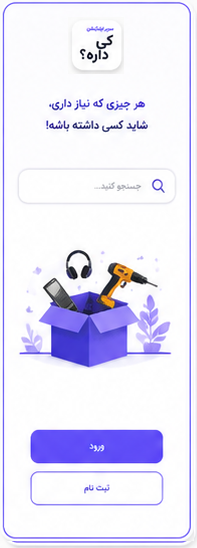
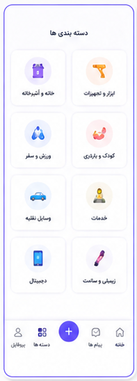

# 📱 کی‌داره | سوپراپلیکیشن خرید حضوری

<div align="center">


[](https://github.com/kidareh-team/kidareh)
[](LICENSE)
[](https://nodejs.org)
[](https://react.dev)
[](https://www.typescriptlang.org)
[](CONTRIBUTING.md)

**سوپراپلیکیشن سریع و هوشمند برای پیدا کردن کالاها در فروشگاه‌های اطراف و خرید حضوری**

[نمایش زنده](https://kidareh.com) · [گزارش مشکل](https://github.com/kidareh-team/kidareh/issues) · [درخواست ویژگی](https://github.com/kidareh-team/kidareh/issues/new)

</div>

---

## 📋 فهرست مطالب

- [درباره پروژه](#-درباره-پروژه)
- [ویژگی‌های کلیدی](#-ویژگی‌های-کلیدی)
- [اسکرین‌شات‌ها](#-اسکرین‌شات‌ها)
- [تکنولوژی‌ها](#️-تکنولوژی‌ها)
- [معماری](#-معماری)
- [پیش‌نیازها](#-پیش‌نیازها)
- [نصب و راه‌اندازی](#-نصب-و-راه‌اندازی)
- [ساختار پروژه](#-ساختار-پروژه)
- [متغیرهای محیطی](#-متغیرهای-محیطی)
- [Scripts](#-scripts)
- [API Documentation](#-api-documentation)
- [Deploy](#-deploy)
- [امنیت](#-امنیت)
- [تست](#-تست)
- [مشارکت](#-مشارکت)
- [مجوز](#-مجوز)
- [تیم](#-تیم)
- [پشتیبانی](#-پشتیبانی)

---

## 🎯 درباره پروژه

**کی‌داره** یک پلتفرم نوآورانه برای ارتباط مستقیم خریداران و فروشندگان اطراف شماست که با استفاده از فناوری‌های مدرن و هوش مصنوعی، تجربه خرید حضوری را متحول می‌کند.

### 🎪 چرا کی‌داره؟

| مشکل | راه‌حل کی‌داره |
|------|--------------|
| ❌ نمی‌دونم فروشگاه اطرافم چه کالاهایی داره | ✅ جستجوی لحظه‌ای با نقشه تعاملی |
| ❌ باید زنگ بزنم و بپرسم موجوده یا نه | ✅ چت آنلاین مستقیم با فروشنده |
| ❌ قیمت‌ها مشخص نیست | ✅ قیمت‌گذاری شفاف و به‌روز |
| ❌ نمی‌دونم فروشگاه معتبره یا نه | ✅ سیستم امتیازدهی و نظرات کاربران |
| ❌ باید حضوری برم ببینم کالا رو | ✅ عکس‌ها، توضیحات کامل و نقشه مسیر |

### 🏆 ویژگی‌های منحصربه‌فرد

- 🧠 **هوش مصنوعی Google Gemini** - جستجوی صوتی و دستیار هوشمند
- 📍 **موقعیت‌یابی دقیق** - پیدا کردن نزدیک‌ترین فروشگاه‌ها
- 💬 **چت Real-time** - ارتباط فوری با Socket.IO
- 📱 **PWA** - نصب روی موبایل بدون نیاز به استور
- 🎨 **UI/UX مدرن** - طراحی زیبا با Tailwind CSS و Framer Motion
- ⚡ **سرعت بالا** - بهینه‌سازی شده با Vite و React 19
- 🔒 **امنیت پیشرفته** - Helmet, JWT, Rate Limiting
- 💰 **درآمدزایی** - سیستم معرفی و کسب پورسانت

---

## ⭐ ویژگی‌های کلیدی

### 🔍 برای خریداران

<table>
<tr>
<td width="50%">

#### 🗺️ جستجوی نقشه‌محور
- نمایش فروشگاه‌های اطراف روی نقشه
- فیلتر بر اساس فاصله و دسته‌بندی
- مسیریابی به فروشگاه با یک کلیک

</td>
<td width="50%">

#### 🎤 دستیار صوتی
- جستجوی کالا با صدا
- تبدیل گفتار به متن با Gemini
- پیشنهادات هوشمند بر اساس نیاز

</td>
</tr>
<tr>
<td>

#### 💬 چت آنلاین
- گفتگوی لحظه‌ای با فروشنده
- ارسال عکس و فایل
- نوتیفیکیشن آنی برای پیام‌ها

</td>
<td>

#### 🔖 ذخیره و علاقه‌مندی‌ها
- لیست کالاهای مورد علاقه
- مقایسه قیمت فروشگاه‌های مختلف
- اعلان تغییر قیمت

</td>
</tr>
</table>

### 🏪 برای فروشندگان

<table>
<tr>
<td width="50%">

#### 📊 پنل مدیریت حرفه‌ای
- ثبت و ویرایش کالاها
- مدیریت موجودی
- آمار فروش و بازدید

</td>
<td width="50%">

#### 🎯 بازاریابی هوشمند
- نمایش در نتایج جستجوی اطراف
- برچسب "ویژه" برای کالاها
- افزایش دیده شدن

</td>
</tr>
<tr>
<td>

#### 💳 پرداخت آسان
- درگاه پرداخت آنلاین
- فاکتور الکترونیکی
- پیگیری تراکنش‌ها

</td>
<td>

#### 📱 مدیریت از موبایل
- دسترسی از هر جا
- آپلود سریع عکس
- پاسخ سریع به مشتریان

</td>
</tr>
</table>

### 🛡️ برای ادمین

- 📈 **داشبورد تحلیلی** - آمار کامل سیستم
- 👥 **مدیریت کاربران** - بررسی و تایید فروشگاه‌ها
- 🚨 **سیستم گزارش‌دهی** - رسیدگی به تخلفات
- 💰 **مدیریت مالی** - تسویه حساب و پورسانت‌ها
- 🔧 **تنظیمات سیستم** - پیکربندی کامل پلتفرم

---

## 📸 اسکرین‌شات‌ها

<div align="center">

### 📱 موبایل




### 🗺️ نقشه تعاملی


### 💬 چت Real-time


</div>

---

## 🛠️ تکنولوژی‌ها

### 🎨 Frontend

| تکنولوژی | نسخه | کاربرد |
|----------|------|--------|
| [React](https://react.dev) | 19.0.0 | کتابخانه UI |
| [TypeScript](https://www.typescriptlang.org) | 5.8.2 | Type Safety |
| [Vite](https://vitejs.dev) | 6.2.0 | Build Tool |
| [Tailwind CSS](https://tailwindcss.com) | 4.1.14 | استایل‌دهی |
| [Framer Motion](https://www.framer.com/motion/) | 12.23.24 | انیمیشن |
| [React Query](https://tanstack.com/query) | 5.62.3 | State Management |
| [React Router](https://reactrouter.com) | 7.1.3 | Routing |
| [Leaflet](https://leafletjs.com) | 1.9.4 | نقشه |
| [Socket.IO Client](https://socket.io) | 4.8.3 | WebSocket |
| [Lucide React](https://lucide.dev) | 0.468.0 | آیکون‌ها |
| [Zod](https://zod.dev) | 3.24.1 | Validation |
| [React Hook Form](https://react-hook-form.com) | 7.54.2 | فرم‌ها |

### ⚙️ Backend

| تکنولوژی | نسخه | کاربرد |
|----------|------|--------|
| [Node.js](https://nodejs.org) | 20+ | Runtime |
| [Express](https://expressjs.com) | 4.21.2 | Web Framework |
| [TypeScript](https://www.typescriptlang.org) | 5.8.2 | Type Safety |
| [Better SQLite3](https://github.com/WiseLibs/better-sqlite3) | 12.2.0 | Database |
| [Socket.IO](https://socket.io) | 4.8.3 | WebSocket |
| [Helmet](https://helmetjs.github.io) | 8.2.0 | Security |
| [JWT](https://jwt.io) | 9.0.3 | Authentication |
| [Winston](https://github.com/winstonjs/winston) | 3.19.0 | Logging |
| [Zod](https://zod.dev) | 3.24.1 | Validation |
| [Morgan](https://github.com/expressjs/morgan) | 1.11.0 | HTTP Logger |

### 🧪 Testing & Quality

| تکنولوژی | کاربرد |
|----------|--------|
| [Vitest](https://vitest.dev) | Unit Testing |
| [Playwright](https://playwright.dev) | E2E Testing |
| [ESLint](https://eslint.org) | Linting |
| [Prettier](https://prettier.io) | Code Formatting |
| [Husky](https://typicode.github.io/husky/) | Git Hooks |
| [Lint-staged](https://github.com/okonet/lint-staged) | Pre-commit |

### 📦 Services

| سرویس | کاربرد |
|-------|--------|
| [Google Gemini AI](https://ai.google.dev) | دستیار هوشمند |
| [Kavenegar](https://kavenegar.com) | ارسال SMS |
| [پی‌پینگ](https://www.payping.ir) | درگاه پرداخت |
| [Liara](https://liara.ir) | Hosting |

---

## 🏗️ معماری

```mermaid
graph TB
    A[Client Browser/PWA] -->|HTTP/WS| B[Nginx/Liara]
    B --> C[Express Server]
    C --> D[Socket.IO]
    C --> E[REST API]
    E --> F[SQLite DB]
    E --> G[File Storage]
    C --> H[External Services]
    H --> I[Gemini AI]
    H --> J[SMS Gateway]
    H --> K[Payment Gateway]
    
    style A fill:#61dafb
    style C fill:#68a063
    style F fill:#003b57
    style I fill:#4285f4